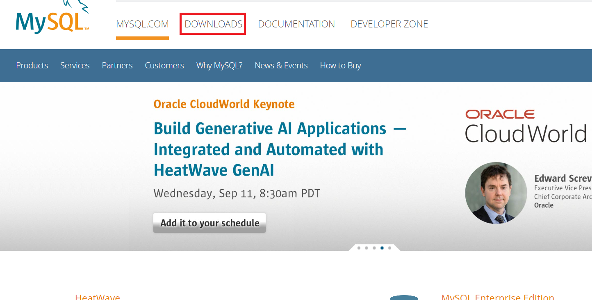
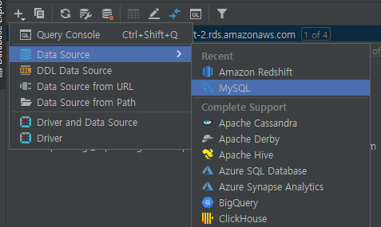

# Chapter 1. Database 설계- 로컬 DB 세팅하기

# 로컬 DB 세팅

윈도우를 기준으로 쓰였으며 만약 mac 사용자라면 밑에 과정에서 mac으로 바꾸어서 진행해 주시거나 homebrew를 사용해서 다운로드해 주세요!

- **MySQL 다운로드하기**
    
    MySQL 홈페이지로 들어갑니다.
    
    [MySQL](https://www.mysql.com/)
    
    DOWNLOADS로 들어갑니다.
    
    
    
    MySQL Community (GPL) Downloads를 클릭합니다.
    
    
    
    MySQL Installer for Windows에 들어갑니다. (만약 MySQL 9점 대를 쓰고 싶거나 mac 사용자라면 Community Server에서 다운로드하시면 됩니다.)
    
    
    
    두 번 째 것으로 다운로드를 눌러줍니다.
    
    
    
    No thanks, just start my download.를 눌러줍니다.
    
    
    
    설치가 된 후 실행시키면 다음과 같은 화면이 나올 텐데 필요한 것을 눌러줍니다. (저는 어느 것들을 다운로드할 수 있는지 보기 위해 Custom으로 들어가겠습니다.)
    
    
    
    Custom에서 필요한 것을 넣고 Next를 눌러줍니다. (저희는 Workbench 대신 datagrip이라는 것을 쓰긴 할 건데 일단 workbench까지 다운로드하겠습니다.)
    
    
    
    Execute를 눌러줍니다.
    
    
    
    완료가 되면 Next를 눌러줍니다.
    
    
    
    Next 눌러줍니다.
    
    
    
    이제 설정 화면이 나올텐데 비밀 번호 설정 전까지 Next눌러줍니다.
    
    
    
    
    
    비밀번호를 설정해 주고 Next를 눌러줍니다. (나중에 접속할 때 필요하니 절대 잊어버리면 안 돼요!)
    
    
    
    그 이후로는 계속 Next 눌러주시면 됩니다.
    
    
    
    
    
    Execute누르고 세팅이 완료 되면 설치는 완료 되었습니다.
    
    
    

이제 DB에 접속해봅시다!

데이터베이스 접속 tool은 mysql work bench를 사용할수도 있고,
다양한 tool이 있는데 저는 개인적으로 **DataGrip**을 추천합니다. 

DataGrip 설치 시, 아래 내용을 참고해주세요!

- **DataGrip 다운로드하기**
    
    다운로드는 이곳에서 하시면 됩니다! 
    
    [DataGrip 다운로드: 데이터베이스 및 SQL용 크로스 플랫폼 IDE](https://www.jetbrains.com/ko-kr/datagrip/download/?section=windows)
    
    처음 다운로드하게 된다면 
    
    
    
    이런 창이 뜨게 될텐데요.
    
    여기서 30일 무료 평가판을 사용하는 것도 좋지만 저희는 대학생인 만큼 학교의 순기능을 이용해보겠습니다.
    
    라이선스 활성화를 눌러주세요. 
    
    
    
    그럼 이렇게 로그인하라는 창이 뜹니다.
    
    잠깐 제쳐두고 
    
    [Free JetBrains Student Pack](https://www.jetbrains.com/academy/student-pack/#students)
    
    이 사이트에서 학생인증을 합시다. 
    
    
    
    여기로 들어가서 학교 이메일로 학생 인증 계정을 만든 후에 Datagrip으로 돌아와서 로그인을 하면 됩니다. 
    

## DB 접속

DataGrip에서 아래처럼 새로 연결을 만들어서

아래 사진처럼 **Host에** localhost를 넣고,

**User와 Password에 로컬 DB의 아이디와 Password를** 해주세요. (아무 것도 설정 안 하셨다면 User는 root 입니다!)
**이후 Test Connection**을 해주세요.

아래 사진처럼 뜨면 **성공**입니다!

**간편하게 Intellij로도 접속이 가능합니다! (밑의 페이지에 어떻게 하는 지 넣어 놓았습니다!) (Intellij를 사용하시는 분들만 참고하시면 될 것 같습니다!)**

[Intellij로 접속하는 방법](Intellij%EB%A1%9C%20%EC%A0%91%EC%86%8D%ED%95%98%EB%8A%94%20%EB%B0%A9%EB%B2%95%20271b57f4596b8189b334e949a34558d6.md)

docker까지 하기에는 한 주 차에 담을 내용이 너무 많을 것 같아 직접 설치해 보는 방향으로 하였습니다. 나중에 시간이 된다면 docker로도 한번 해보면 좋을 것 같습니다.

또한 배포할 때는 로컬 DB 보다는 클라우드 환경에서 하는 것이 좋은데 이 부분은 **부록. AWS RDS 설정 및 접속**을 확인하여 주세요!